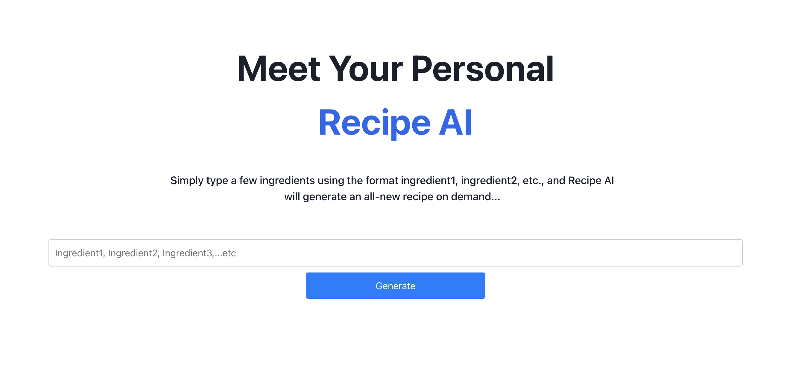

AWS Workshop implementation for an AI Based recipe app

#### **Components**
- **Frontend:** Built using AWS Amplify
- **Authentication:** Managed through Amazon Cognito
- **Backend:** Implemented using AWS Lambda and AWS AppSync (GraphQL API) 
- **AI Processing:** Amazon Bedrock - Claude 3 Sonnet foundation model

### **Workflow**

1. **User Input:** The user enters ingredients via the web interface.
2. **Request Processing:** The frontend sends the request to the backend via AWS AppSync.
3. **AI Model Invocation:** AWS Lambda processes the request and invokes Amazon Bedrock's Claude 3 Sonnet model to generate a recipe.
4. **Response Delivery:** The AI-generated recipe is sent back to the frontend and displayed to the user. 
 

